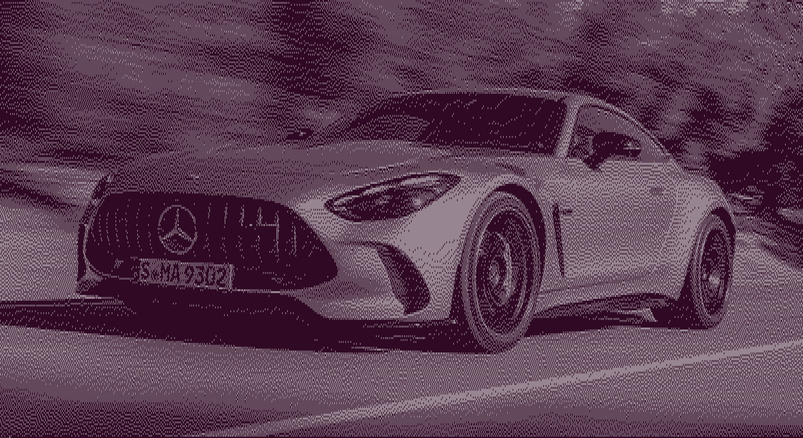
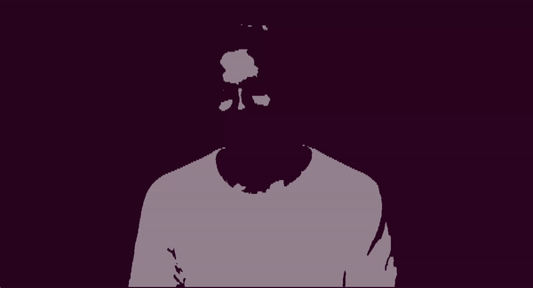
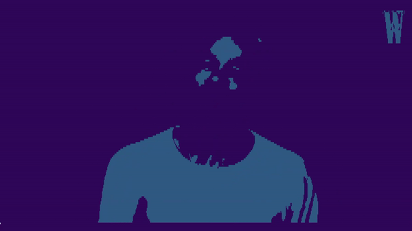

### video [from](https://www.youtube.com/watch?v=EOLafh8DPFM&t) 

## How to use?

### For more info about arguments use

```shell
python main.py --help
```

### Requirements
1. [install ffmpeg ](https://phoenixnap.com/kb/install-ffmpeg-ubuntu) for audio extracting process 
2. install xdotool for auto-change terminal font size
```shell
sudo apt-get install xdotool
```

#### Activate virtual environment
```shell
source activate_venv.sh
```

### show YouTube video
`$ python main.py --youtube_link="https://www.youtube.com/watch?v=EOLafh8DPFM&t" --background_colour=#34105e --font_colour=CYAN`

### show local video

> if background colour does not set, black(#000000) is choosen as default

`$ python main.py --local_video_path=/home/rasul/Personal/py/zrx/media/video/cherimoya.mp4 --font_colour=CYAN`

### show local image

> font_colour default is LIGHTGREEN_EX

`$ python main.py --local_image_path=/home/rasul/Personal/py/zrx/media/img/car.jpg`

### show video from camera
`$ python main.py --use_camera=1`


## Tips
> Stop video using Ctrl+C and resume by pressing Enter. Double Ctrl+C for exit


## INFO

```
3rd dimensional matrix

[
  [ [199, 213, 216, 255] - pixel, RGB, and 4th value is alpha channel: transparency or opacity
    [199, 213, 212, 255], 
    [199, 213, 220, 255], 
    [199, 213, 216, 255] ] - row
]
```
